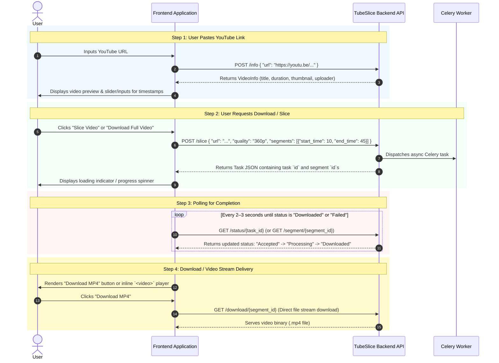

# TubeSlice Backend Documentation

Welcome to the **TubeSlice Backend** API documentation. TubeSlice is an asynchronous YouTube video downloader and slicer built with **FastAPI**, **Celery**, **Redis**, **SQLAlchemy (SQLite)**, and **yt-dlp**.

---

## 🏗️ Architecture & Technology Stack

- **Framework**: [FastAPI](https://fastapi.tiangolo.com/)
- **Task Queue**: [Celery](https://docs.celeryq.dev/) with [Redis](https://redis.io/)
- **Media Processing**: `yt-dlp` & `ffmpeg`
- **Database**: SQLite via SQLAlchemy ORM
- **Authentication**: JWT (JSON Web Tokens) with Password Hashing (`passlib` / `bcrypt`)

---

## 📱 Frontend Integration Guide (Step-by-Step Flow)

If you are building the frontend (React, Next.js, Vue, Mobile App, etc.), follow this exact step-by-step sequence to integrate with TubeSlice:



### Detailed Frontend Call Sequence:

1. **`POST /info`** *(Step 1: Preview)*
   - **When to call**: When the user pastes a YouTube URL into your search bar.
   - **What to send**: `{ "url": "https://www.youtube.com/watch?v=..." }`
   - **What to do with response**: Use the returned `title`, `duration` (in seconds), and `thumbnail` to populate your UI timeline/slider.

2. **`POST /slice`** *(Step 2: Initiate Download)*
   - **When to call**: When the user picks start/end timestamps and clicks "Slice & Download".
   - **What to send**: 
     ```json
     {
       "url": "https://www.youtube.com/watch?v=...",
       "quality": "360p",
       "segments": [{ "start_time": 10, "end_time": 45 }]
     }
     ```
   - **What to store**: Store the returned `id` (task ID) and `segments[0].id` (segment ID) in local component state.

3. **`GET /status/{task_id}`** *(Step 3: Progress Polling)*
   - **When to call**: Start a `setInterval` timer polling every **2 seconds** after calling `/slice`.
   - **What to check**: Check `status` inside the returned object.
     - If `"Accepted"` or `"Processing"`: Keep polling.
     - If `"Downloaded"`: Stop polling timer. Show the Download button or HTML5 `<video>` tag!
     - If `"Failed"`: Stop polling timer. Display an error message to the user.

4. **`GET /download/{segment_id}`** *(Step 4: Save or Play Video)*
   - **When to use**: Set this URL as the `src` attribute of an `<a download>` link or HTML5 `<video src="...">` player:
     ```html
     <a href="http://127.0.0.1:8080/download/{segment_id}" download>Download MP4</a>
     ```

---

## 🔑 Authentication Headers

For protected routes (such as `/dashboard`), pass the JWT token in the HTTP Authorization header:

```http
Authorization: Bearer <your_jwt_token>
```

---

## 📡 API Endpoints Reference

### 1. General & System Routes

#### `GET /`
- **Description**: Health check endpoint.
- **Response**:
  ```json
  {
    "message": "hello world! \n it is Tube Slice!"
  }
  ```

#### `GET /dashboard`
- **Authentication**: Required (`Bearer <token>`)
- **Description**: Authenticated user dashboard test route.

---

### 2. Auth Routes (`/`)

#### `POST /signup`
- **Description**: Registers a new user account.
- **Request Body** (`application/json`):
  ```json
  {
    "first_name": "John",
    "last_name": "Doe",
    "email": "john.doe@example.com",
    "password": "securepassword123"
  }
  ```
- **Response** (`200 OK`):
  ```json
  {
    "id": "uuid-v4-string",
    "first_name": "John",
    "last_name": "Doe",
    "email": "john.doe@example.com",
    "role": "user"
  }
  ```

#### `POST /login`
- **Description**: Authenticates user credentials and returns a JWT access token.
- **Request Body** (`application/json`):
  ```json
  {
    "email": "john.doe@example.com",
    "password": "securepassword123"
  }
  ```
- **Response** (`200 OK`):
  ```json
  {
    "token": "eyJhbGciOiJIUzI1NiIsInR5cCI6IkpXVCJ9..."
  }
  ```

---

### 3. Video Download & Slicing Routes

#### `POST /info`
- **Description**: Fetches video metadata and all available download formats without creating DB records or downloading files.
- **Request Body**:
  ```json
  {
    "url": "https://www.youtube.com/watch?v=dQw4w9WgXcQ"
  }
  ```
- **Response** (`200 OK`):
  ```json
  {
    "title": "Rick Astley - Never Gonna Give You Up",
    "duration": 212,
    "uploader": "Rick Astley",
    "youtube_url": "https://www.youtube.com/watch?v=dQw4w9WgXcQ",
    "thumbnail": "https://i.ytimg.com/vi/dQw4w9WgXcQ/hqdefault.jpg",
    "formats": [
      { "format_id": "18", "ext": "mp4", "resolution": "640x360", "note": "360p" },
      { "format_id": "22", "ext": "mp4", "resolution": "1280x720", "note": "720p" },
      { "format_id": "136", "ext": "mp4", "resolution": "1280x720", "note": "720p" },
      { "format_id": "251", "ext": "webm", "resolution": "audio only", "note": "medium" }
    ]
  }
  ```
- **Usage**: The frontend can render the `formats` array and let the user choose a target resolution. The `format_id` is the exact yt-dlp stream identifier, and `quality` is a convenience label like `360p` or `720p`.

#### `POST /slice`
- **Description**: Creates a download task for either a full video or multiple cut time slices. You can request a concrete `format_id` or a `quality` preset.
- **Request Body**:
  ```json
  {
    "url": "https://www.youtube.com/watch?v=dQw4w9WgXcQ",
    "quality": "720p",
    "format_id": "136",
    "segments": [
      { "start_time": 10, "end_time": 45 }
    ]
  }
  ```
  - `format_id` is the most precise option because it selects the exact yt-dlp stream.
  - `quality` is also supported as a fallback such as `360p`, `480p`, `720p`.
  - If both are provided, `format_id` takes precedence.
  - If `segments` is omitted, defaults to full video 0 -> video duration.
- **Response** (`200 OK`):
  ```json
  {
    "id": "task-uuid",
    "title": "Rick Astley - Never Gonna Give You Up",
    "duration": 212,
    "uploader": "Rick Astley",
    "youtube_url": "https://www.youtube.com/watch?v=dQw4w9WgXcQ",
    "status": "Accepted",
    "createdAt": 1723300000.0,
    "segments": [
      {
        "id": "segment-uuid",
        "download_id": "task-uuid",
        "start_time": 10,
        "end_time": 45,
        "status": "Accepted",
        "format": "136",
        "createdAt": 1723300000.0
      }
    ]
  }
  ```

#### `GET /status/{task_id}`
- **Description**: Check status of a download task. Returns status (`Accepted`, `Processing`, `Downloaded`, `Failed`).

#### `GET /segment/{segment_id}`
- **Description**: Returns segment status details if processing, or streams the `.mp4` video binary if completed.

#### `GET /download/{segment_id}`
- **Description**: Direct stream/download link for an existing `.mp4` segment file.

#### `GET /all_downloads`
- **Description**: Retrieves history of all created tasks and segments.

---

## ⚡ Resolution selection behavior

The backend now supports all downloadable video resolutions returned by yt-dlp.

- `GET /info` returns the list of available `formats`.
- Frontend clients can display each option using `resolution`, `ext`, and `note`.
- `POST /slice` accepts either a `quality` string or a specific `format_id`.
- The worker resolves the exact yt-dlp selector before downloading the chosen time range.

### Example frontend usage

```json
{
  "url": "https://www.youtube.com/watch?v=dQw4w9WgXcQ",
  "format_id": "136",
  "segments": [{ "start_time": 0, "end_time": 30 }]
}
```

or

```json
{
  "url": "https://www.youtube.com/watch?v=dQw4w9WgXcQ",
  "quality": "720p",
  "segments": [{ "start_time": 0, "end_time": 30 }]
}
```

This allows the API to download the exact user-selected resolution instead of only a generic default quality.

#### `GET /status/{task_id}`
- **Description**: Check status of a download task. Returns status (`Accepted`, `Processing`, `Downloaded`, `Failed`).

#### `GET /segment/{segment_id}`
- **Description**: Returns segment status details if processing, or streams the `.mp4` video binary if completed.

#### `GET /download/{segment_id}`
- **Description**: Direct stream/download link for an existing `.mp4` segment file.

#### `GET /all_downloads`
- **Description**: Retrieves history of all created tasks and segments.

---

## ⚡ Background Workers & Running locally

### 1. Start Redis
Ensure Redis server is running on default port `6379`.

### 2. Start Celery Worker
```bash
celery -A app.worker.celery_app worker -l info -P solo
```

### 3. Start FastAPI Server
```bash
uvicorn main:app --reload --port 8080
```
