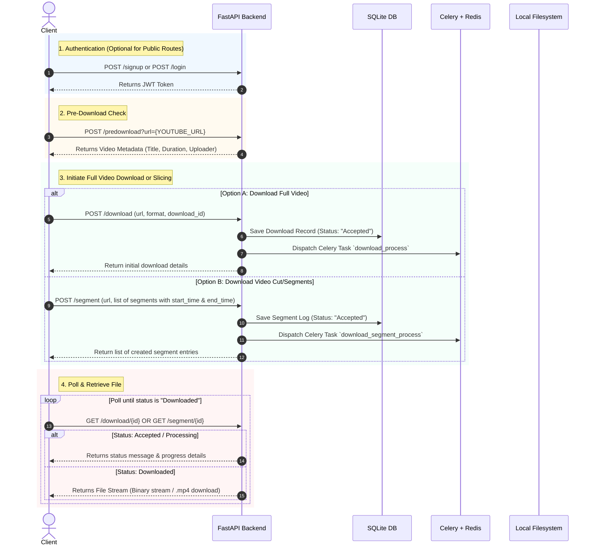

# TubeSlice Backend Documentation

Welcome to the **TubeSlice Backend** API documentation. TubeSlice is an asynchronous YouTube video downloader and slicer built with **FastAPI**, **Celery**, **Redis**, **SQLAlchemy (SQLite)**, and **yt-dlp**.

---

## 🏗️ Architecture & Technology Stack

- **Framework**: [FastAPI](https://fastapi.tiangolo.com/)
- **Task Queue**: [Celery](https://docs.celeryq.dev/) with [Redis](https://redis.io/)
- **Media Processing**: `yt-dlp` & `ffmpeg`
- **Database**: SQLite via SQLAlchemy ORM
- **Authentication**: JWT (JSON Web Tokens) with Password Hashing (`passlib` / `bcrypt`)

---

## 🔄 Recommended Workflow

To interact effectively with TubeSlice, follow this standard workflow:



---

## 🔑 Authentication Headers

For protected routes (such as `/dashboard`), pass the JWT token in the HTTP Authorization header:

```http
Authorization: Bearer <your_jwt_token>
```

---

## 📡 API Endpoints Reference

### 1. General & System Routes

#### `GET /`
- **Description**: Health check endpoint.
- **Request Body**: None
- **Response**:
  ```json
  {
    "message": "hello world! \n it is Tube Slice!"
  }
  ```

#### `GET /dashboard`
- **Authentication**: Required (`Bearer <token>`)
- **Description**: Authenticated user dashboard test route.
- **Response**:
  - `200 OK`:
    ```json
    {
      "data": "hi logged in user! here is your data: {'id': '...', 'first_name': '...', 'last_name': '...', 'email': '...', 'role': '...'}"
    }
    ```
  - `401 Unauthorized`: Token missing, invalid, or expired.

---

### 2. Auth Routes (`/`)

#### `POST /signup`
- **Description**: Registers a new user account.
- **Request Body** (`application/json`):
  ```json
  {
    "first_name": "John",
    "last_name": "Doe",
    "email": "john.doe@example.com",
    "password": "securepassword123"
  }
  ```
- **Response** (`200 OK`):
  ```json
  {
    "id": "uuid-v4-string",
    "first_name": "John",
    "last_name": "Doe",
    "email": "john.doe@example.com",
    "role": "user"
  }
  ```

#### `POST /login`
- **Description**: Authenticates user credentials and returns a JWT access token.
- **Request Body** (`application/json`):
  ```json
  {
    "email": "john.doe@example.com",
    "password": "securepassword123"
  }
  ```
- **Response** (`200 OK`):
  ```json
  {
    "token": "eyJhbGciOiJIUzI1NiIsInR5cCI6IkpXVCJ9..."
  }
  ```

---

### 3. User Management Routes (`/users`, `/delete`)

#### `GET /users`
- **Description**: Fetches all registered users.
- **Request Body**: None
- **Response** (`200 OK`):
  ```json
  [
    {
      "id": "uuid-v4-string",
      "first_name": "John",
      "last_name": "Doe",
      "email": "john.doe@example.com",
      "role": "user"
    }
  ]
  ```
  *Or if empty:*
  ```json
  {
    "message": "there are no users in database"
  }
  ```

#### `DELETE /delete`
- **Description**: Deletes a user by their ID.
- **Query Parameters**:
  - `id` (string, required): The target user's UUID.
- **Response** (`200 OK`):
  ```json
  {
    "id": "uuid-v4-string",
    "first_name": "John",
    "last_name": "Doe",
    "email": "john.doe@example.com",
    "role": "user"
  }
  ```

---

### 4. Download & Slicing Routes (Tags: `Download`)

#### `POST /predownload`
- **Description**: Fetches video metadata without starting a download.
- **Query Parameters**:
  - `url` (string, required): The YouTube video URL.
- **Response** (`200 OK`):
  ```json
  {
    "msg": "{'title': 'Video Title', 'duration': 300, 'uploader': 'Channel Name', 'youtube_url': 'https://www.youtube.com/watch?v=...'}"
  }
  ```

#### `POST /download`
- **Description**: Logs a download request and queues a background task to download the full video.
- **Request Body** (`application/json`):
  ```json
  {
    "download_id": "unique-client-or-generated-id",
    "url": "https://www.youtube.com/watch?v=dQw4w9WgXcQ",
    "format": "mp4"
  }
  ```
- **Response** (`200 OK`):
  ```json
  {
    "message": "download info: id='...' title='...' duration=... uploader='...' status='Accepted' segments=[...]"
  }
  ```

#### `POST /segment`
- **Description**: Requests one or multiple specific timestamp slices/segments of a YouTube video.
- **Request Body** (`application/json`):
  ```json
  {
    "url": "https://www.youtube.com/watch?v=dQw4w9WgXcQ",
    "segments": [
      {
        "download_id": "existing-or-target-download-id",
        "start_time": 10,
        "end_time": 45,
        "format": "mp4"
      }
    ]
  }
  ```
- **Response** (`200 OK`):
  ```json
  {
    "msg": "[segmentOutput(id='segment-uuid', download_id='...', start_time=10, end_time=45, status='Accepted', format='mp4', createdAt=1723300000.0)]"
  }
  ```

#### `GET /download/{id}`
- **Description**: Checks status of a download task. Returns status message if processing/pending, or Streams/Downloads the resulting `.mp4` file if completed.
- **Path Parameters**:
  - `id` (string, required): Download ID.
- **Response**:
  - **When Pending/Accepted**:
    ```json
    {
      "message": "Not downloaded yet \n full info here: <DownloadObject>"
    }
    ```
  - **When Downloaded (Single Segment/Full Video)**:
    - Headers: `Content-Type: application/octet-stream`
    - Body: Binary `.mp4` video stream.

#### `GET /segment/{id}`
- **Description**: Checks status of a specific segment download. Streams/downloads the segmented file when ready.
- **Path Parameters**:
  - `id` (string, required): Segment ID.
- **Response**:
  - **Status: `Accepted`**:
    ```json
    {
      "message": "Your task is accepted wait until its ready",
      "data": "<SegmentObject>"
    }
    ```
  - **Status: `Processing`**:
    ```json
    {
      "message": "Your task is being downloaded wait",
      "data": "<SegmentObject>"
    }
    ```
  - **Status: `Downloaded`**:
    - Headers: `Content-Type: application/stream-octet`
    - Body: Binary `.mp4` video stream for segment `{id}.mp4`.

#### `GET /all_downloads`
- **Description**: Retrieves all recorded downloads and their segments.
- **Request Body**: None
- **Response** (`200 OK`):
  ```json
  [
    {
      "id": "download-id",
      "title": "Video Title",
      "duration": 300,
      "uploader": "Uploader Name",
      "youtube_url": "https://www.youtube.com/watch?v=...",
      "createdAt": 1723300000.0,
      "status": "Downloaded",
      "segments": [
        {
          "id": "segment-id",
          "download_id": "download-id",
          "start_time": 0,
          "end_time": 300,
          "status": "Downloaded",
          "format": "mp4",
          "createdAt": 1723300000.0
        }
      ]
    }
  ]
  ```

---

## ⚡ Background Workers & Running locally

### 1. Start Redis
Ensure Redis server is running locally on default port `6379`.

### 2. Start Celery Worker
Run the Celery worker process from the project root:
```bash
celery -A app.worker.celery worker --loglevel=info -P solo
```

### 3. Start FastAPI Server
Run the FastAPI development server:
```bash
python main.py
```
Or via uvicorn directly:
```bash
uvicorn main:app --reload --host 127.0.0.1 --port 8000
```
